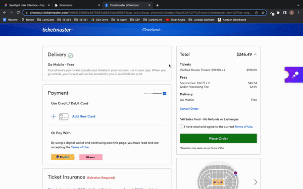

# Spotlight

## Usage

1. Clone

```
git clone git@github.com:susantoscott/spotlight.git
```

2. Install NPM

```
npm install
```

3. Apply Chrome Extension

```
chrome://extensions => Load Unpacked => spotlight/dist
```

4. Enjoy!

- Checkout at:
  - ticketmaster.com
  - seatgeek.com
- Scraped from:
  - VividSeats
  - StubHub
  - TickPick

## Progress


