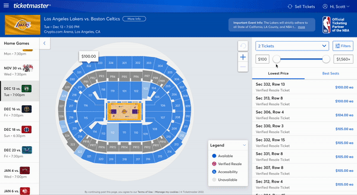

# Spotlight

## Usage

1. Clone

```
git clone git@github.com:susantoscott/spotlight.git
```

2. Install NPM

```
npm install
```

3. Install Python3 Modules

```
pip3 install requirements.txt
```

4. Install ChromeWebdriver

```
MacOS
brew install --cask chromedriver
brew install --cask google-chrome
Linux
apt get chromedriver
apt get google-chrome
```

5. Apply Chrome Extension

```
chrome://extensions => Load Unpacked => spotlight/dist
```

6. Run Server

```
npm run server
```

7. Enjoy!

- Checkout at:
  - ticketmaster.com
  - seatgeek.com
- Scraped from:
  - stubhub.com

## Progress


