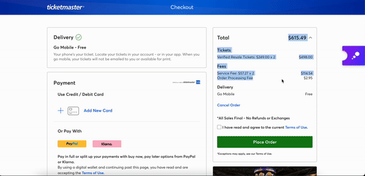

# Spotlight

## Usage

1. Clone

```
git clone git@github.com:susantoscott/spotlight.git
```

2. Build Dependencies

```
npm install
```

3. Build the Extension

```
npm start
```

4. Apply the Extension

```
chrome://extensions => Load Unpacked => spotlight/dist
```

5. Enjoy!

- Verify that it works:

  - go to my [example checkout page](https://www.tryspotlight.xyz/example) and test the extension

- Checkout at:
  - `seatgeek.com`
  - `stubhub.com`
  - `ticketmaster.com`
  - `tickpick.com`
  - `vividseats.com`
- Scraped from:
  - StubHub
  - TicketMaster
  - TicketSmarter
  - TickPick
  - VividSeats

## Progress


